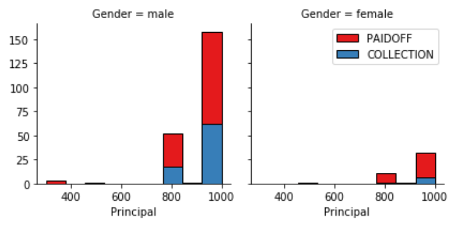
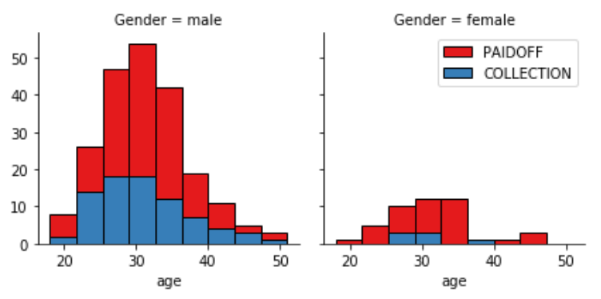
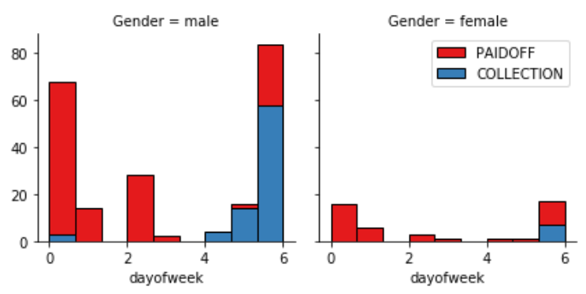

# Classification-with-Python

In this project, we explore various classification methods.

We train our model using our training dataset and then we test it using testing dataset.

Reports at the end show that our model is around 70% accurate.

First we load the data into pandas dataframe:

    df = pd.read_csv('data/loan_train.csv')

Upon veiwing the data, it looks like this:

As we can see, date and time needs to be an object for us to do analysis. We can use this code to fix it:

    df['due_date'] = pd.to_datetime(df['due_date'])
    df['effective_date'] = pd.to_datetime(df['effective_date'])

This is what it looks like now:

Let's see now what the loan status is of our dataset:

    df['loan_status'].value_counts()

260 people have paid off the loan on time while 86 have gone into collection.

Let's plot some columns to underestand data better:

We see that people who get the loan at the end of the week dont pay it off, so lets use Feature binarization to set a threshold values less then day 4.

    df['weekend'] = df['dayofweek'].apply(lambda x: 1 if (x>3)  else 0)

Now, let's convert Categorical features to numerical values and look at gender distrubition:

    df.groupby(['Gender'])['loan_status'].value_counts(normalize=True)

86 % of female pay there loans while only 73 % of males pay there loan

Let's use one hot encoding technique to convert categorical varables to binary variables and append them to the feature Data Frame.

    Feature = df[['Principal','terms','age','Gender','weekend']]
    Feature = pd.concat([Feature,pd.get_dummies(df['education'])], axis=1)
    Feature.drop(['Master or Above'], axis = 1,inplace=True)

