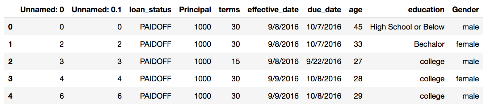
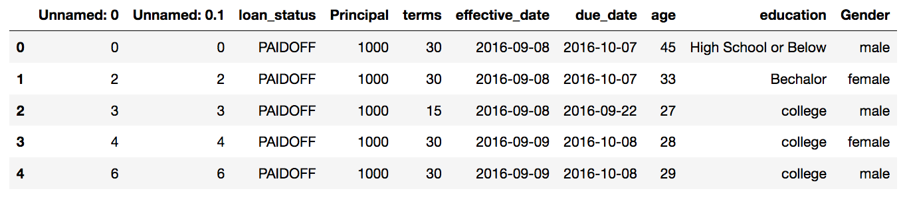

# Classification-with-Python

In this project, we explore various classification methods.

We train our model using our training dataset and then we test it using testing dataset.

Reports at the end show that our model is around 70% accurate.

First we load the data into pandas dataframe:

    df = pd.read_csv('data/loan_train.csv')

Upon veiwing the data, it looks like this:

As we can see, date and time needs to be an object for us to do analysis. We can use this code to fix it:

    df['due_date'] = pd.to_datetime(df['due_date'])
    df['effective_date'] = pd.to_datetime(df['effective_date'])

This is what it looks like now:

